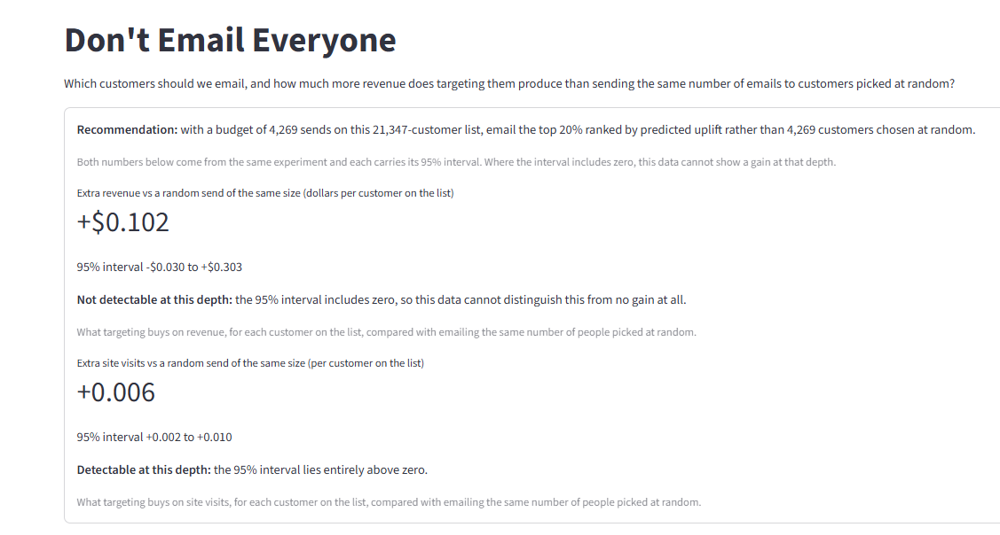

# Don't Email Everyone

**Which customers should we email, and how much more revenue does targeting them produce than sending the same number of emails to customers picked at random?**

<!-- headline:begin -->

## The answer

**With a budget of 4,269 sends to a 21,347-person list, email the top 20% ranked by predicted uplift rather than 4,269 people picked at random.**

"Uplift" here means the customers whose behaviour *changed because they were emailed* — not the customers most likely to buy. Those are different groups, and the difference is the whole point.

Both results below come from the same randomized experiment, and each carries its 95% interval. Where an interval includes zero, this data cannot show a gain.

### Extra revenue: +$0.102 per customer on the list

95% interval **-$0.030 to +$0.303**.

> **Not detectable at this depth:** the 95% interval includes zero, so this data cannot distinguish this from no gain at all.

The revenue gain is the number a reader wants and it is the number this data is weakest on. Spend is a rare, high-variance outcome — most customers spend nothing — and 64,000 customers is not enough to resolve a ten-cent difference. Stated plainly: **this experiment does not demonstrate that targeting increases revenue.**

### Extra site visits: +0.006 per customer on the list

95% interval **+0.002 to +0.010**.

> **Detectable at this depth:** the 95% interval lies entirely above zero.

Targeting does produce a measurable gain in site visits. This is the result the data supports.

### Targeting does not beat emailing everyone

There is no depth at which this data shows a gain against emailing **everyone**. Swept over three outcomes, three rankings and all 101 grid points at 500 bootstrap replicates, not one depth produces a versus-everyone interval that excludes zero from above.

With genuinely free email, the correct action is to email everyone. Beating a blanket send at zero marginal cost requires that the customers you decline to email are ones the email measurably *harms*, and this experiment does not contain enough of them.

This result is about spending a **fixed budget** of sends well — the decision a capacity-constrained marketer actually faces — which is why the comparator throughout is a random send of the same size.

### See it live

**Live app:** <https://dont-email-everyone-hillstrom.streamlit.app/> — move the targeting-depth control and the incremental-revenue estimate moves with it, with its 95% interval beside it.

Streamlit Community Cloud puts an app to sleep after **12 hours without traffic**, so a first visitor may land on a sleep page rather than the app. That is not a broken deployment: click "Yes, get this app back up!" and it wakes in a few seconds. Any visitor can do it — no Streamlit account, no sign-in.

The two images below are the app's own output, so the result is readable even when the app is asleep.



*The app's own headline block, captured at the pre-registered 20% targeting depth.*


*Where the revenue gain is, and is not, distinguishable from zero.*

<!-- headline:end -->

<!-- method:begin -->

## How that answer was produced

### The experiment

64,000 customers were randomly assigned to one of three groups: an email featuring mens merchandise, an email featuring womens merchandise, or no email at all. Site visits, orders and revenue were recorded over the two weeks after the send.

The random assignment is the entire foundation. Because nobody chose who got which email, a difference between the groups is caused by the email rather than by who happened to be in each group — there is no "customers who get emails are keener anyway" explanation to rule out, because the groups were built by a coin flip.

That randomization was **checked, not assumed**: every covariate balances across all three arms, and a joint test over all of them fails to reject. → [`reports/validity.md`](reports/validity.md)

### Average treatment effect

The average treatment effect — **ATE**, the term you will meet in the write-ups — is the average difference in an outcome between the emailed group and the no-email group. That is the whole definition; the notation elsewhere adds precision, not meaning.

For the womens-email arm — the arm this project's targeting rule acts on:

| Outcome | Effect vs no email | 95% interval |
|---|---|---|
| Site visits | **+4.52 percentage points** | +3.89 to +5.16 |
| Orders | **+0.31 percentage points** | +0.15 to +0.47 |
| Revenue | **+$0.42 per customer** | +$0.17 to +$0.68 |

All three are comfortably away from zero. **Email works, on average.**

And that is exactly where the average stops being useful. It says the campaign worked; it does not say *who to email*. Those are different questions, and the rest of this section is about the second one.

### Uplift, and the T-learner

Uplift is the change in *one customer's* behaviour caused by the email. It is never observed for anybody — each customer was either emailed or not, never both, so the number we want is missing for every single row in the data.

The T-learner works around that. Fit one model on the emailed customers and a second model on the no-email customers, then take the difference between the two predictions for the same customer. That difference is the predicted uplift. Both models see only **pre-treatment** customer attributes — history, recency, channel, segment — so nothing measured after the send can leak into a prediction about it.

The honest accounting: of **6** eligible model cells, **2** cleared the project's pre-registered bar, and both are on the **womens** arm — one for **visit**, one for **conversion**. **Four did not clear it.** A README that reports the winners and omits the losers is exactly what the model write-up exists to prevent. → [`reports/model.md`](reports/model.md)

### Qini, and why accuracy is the wrong yardstick

A **Qini curve** asks: if you email the top k% of a ranking rather than the same number of customers picked at random, how much extra outcome do you get? Plot that across every depth and you can see where a ranking earns its keep and where it stops. **Uplift-at-k** is one point on that curve — the answer at a single depth.

A classification score answers a different question. Accuracy and AUC measure whether a model can pick who *will buy*. A targeting rule needs to know who will buy **because they were emailed** — and the customers most likely to buy are frequently the ones who would have bought anyway, which makes a list of likely buyers close to the worst list to spend a send budget on.

So no classification-family figure appears anywhere in this project as a result. That is a deliberate constraint, and it is enforced by tests rather than by intention. → [`reports/metric.md`](reports/metric.md)

### From a ranking to a dollar figure

The headline is **not** a sum of predicted uplift. If it were, it would inherit every one of the model's own optimistic beliefs about itself.

Instead it is estimated from the randomization, on a **held-out half** of the customers the models never saw (32,001 of them), using known-propensity inverse-probability weighting. In plain words: take each customer's *actual, observed* outcome, and re-weight it by how likely that customer was to have received the treatment the policy would have given them. The estimate comes from what really happened, not from what a model predicted would happen.

That distinction is worth its place because the gap is measurable. At the published depth, the model's own belief about its site-visit effect is **1.26 times** what the randomization actually delivered. A pipeline that skipped this step would have published the larger number in good faith. → [`reports/policy.md`](reports/policy.md)

### Going deeper

Four write-ups carry the evidence. The README is the front door; these are the rooms.

- [`reports/validity.md`](reports/validity.md) — does this experiment support causal claims at all? Balance across arms, the omnibus test, all six treatment effects, and interval coverage.
- [`reports/metric.md`](reports/metric.md) — what the Qini convention is here, why it is trustworthy, and the list of things the number may not be used for.
- [`reports/model.md`](reports/model.md) — which model cells were published, which failed the pre-registered bar, and why the failures are reported rather than dropped.
- [`reports/policy.md`](reports/policy.md) — the estimator, the headline, the cost exhibit, and the full list of what would break the claim.

<!-- method:end -->

## Setup and reproduction

Required interpreter: **Python 3.11**.

```
py -3.11 -m venv .venv
.venv\Scripts\activate
python -m pip install --only-binary=:all: -r requirements-dev.txt
```

Run the data pipeline:

```
python -m dont_email_everyone.pipeline all
```

`all` runs `ingest` (the four checksum and schema gates, writing the three input tables) then `analyze` (every Phase 2 estimator, writing the analysis artifacts and figures). Either subcommand can be run on its own; `analyze` reads the committed Parquet inputs and never re-reads the raw CSV.

This produces seven committed artifacts under `data/processed/`:

- `analysis_table.parquet` — the validated 64,000 x 12 table
- `mens_vs_control.parquet` — the mens-email-vs-control analysis frame
- `womens_vs_control.parquet` — the womens-email-vs-control analysis frame
- `balance.parquet` — the 33-row standardized-mean-difference table across all three pairwise arm comparisons, with the per-covariate tests joined on
- `ate.parquet` — the six pre-registered treatment effects with HC3-robust intervals, covariate-adjusted estimates and Holm-adjusted p-values
- `coverage.parquet` — the five-row Welch-interval coverage-vs-cell-size sweep
- `ate.json` — the scalar headline block (effects, seeded bootstrap, omnibus balance test, both winsorization variants, balance and coverage summaries) for quoting without a Parquet read

and three committed deliverables under `reports/`:

- `validity.md` — the Phase 2 write-up: acceptance criteria, balance evidence, the ATE table against its published targets, robustness, and coverage interpretation
- `figures/love_plot.png` — the covariate Love plot with the ±0.1 acceptance band on the canvas
- `figures/ate_forest.png` — the six treatment effects with confidence intervals, panelled by unit

Run the test suite:

```
python -m pytest -q
```

**Network access:** `pip install` requires network access exactly once, at environment setup. The **pipeline** itself makes no network calls, has no fetch code path, and is prevented from acquiring one by `tests/test_no_network.py`, which greps the whole package for network-capable imports. The raw CSV is vendored into `data/raw/` and checksum-verified (SHA-256) on every run rather than downloaded. `data/raw/*.csv` is marked `-text` in `.gitattributes` so the recorded SHA-256 holds on Linux and macOS clones, not only on Windows.

## Data foundation decisions

Six reconciliations between the phase's research/architecture docs and what was actually implemented, recorded here so they are deliberate and not re-litigated in later phases:

| ID | Reconciliation | Resolution |
|----|-----------------|------------|
| C1 | Pandera coercion flag | `coerce=False`, not `coerce=True` as `PITFALLS.md` Pitfall 16 suggested — `coerce=True` was verified to silently truncate a `recency` of `10.5` to `10` and report success, defeating this phase's own success criterion |
| C2 | String column dtype | String columns declared as `str`, not `object` — pandas 3.0 (PDEP-14) makes `str` the default string dtype, and `object` fails outright |
| C3 | Pandera schema style | `pa.DataFrameSchema` (object style), not `DataFrameModel` (class style) as `ARCHITECTURE.md` suggested |
| C4 | Test directory layout | Flat `tests/` for this phase, not `ARCHITECTURE.md`'s tiered `tests/unit\|statistical\|integration` — Phase 2 introduces `tests/statistical/` when it has its first seeded-DGP test |
| C5 | Committed artifact directory | `data/processed/`, not `artifacts/` — `CONTEXT.md` D-09 is a locked user decision that outranks the earlier research-doc naming |
| C6 | `pyarrow` dependency | Admitted as an I/O engine even though `CLAUDE.md`'s allowlist does not name it — the allowlist governs modeling/analysis libraries ("demonstrates the technique from first principles, not library calls"), and `pandas.to_parquet` raises `ImportError` without `pyarrow` while D-09 mandates Parquet |

As of Phase 6 the pins are split three ways, one pin per package: `streamlit` is pinned in the serve-time `requirements.txt` (the file Streamlit Community Cloud installs), the analysis stack lives in `requirements-pipeline.txt`, and `requirements-dev.txt` adds `pytest` — each layering on the previous with `-r`. `streamlit` therefore reaches the development environment through that chain without a second pin. Having `streamlit` installed does **not** relax D-07: `dont_email_everyone/` must still never import it, and that remains enforced by `tests/test_no_network.py::test_package_does_not_import_streamlit`.

The setup command above (`pip install --only-binary=:all: -r requirements-dev.txt`) is unchanged and still installs the full analysis stack, so the fresh-clone reproduction path is unaffected by the split.