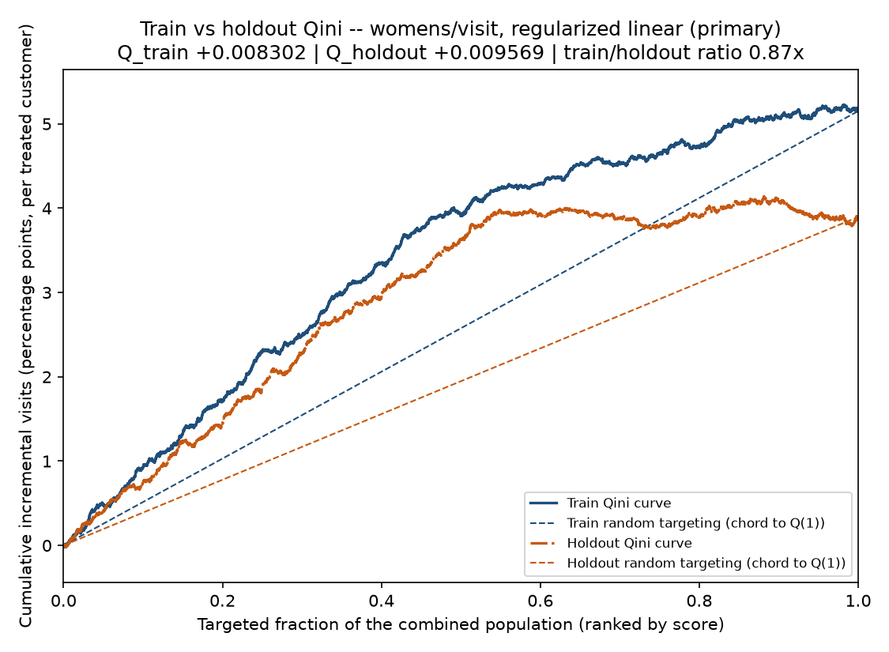
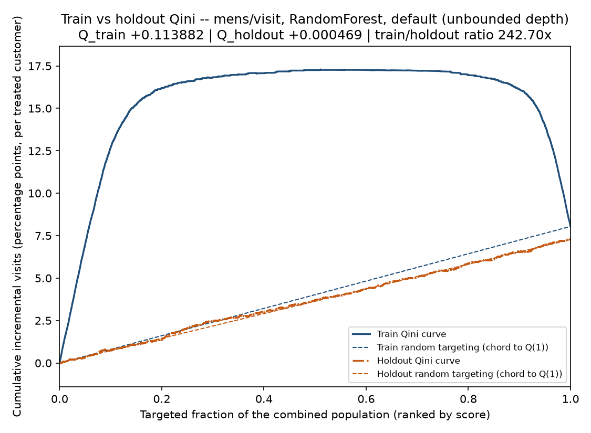
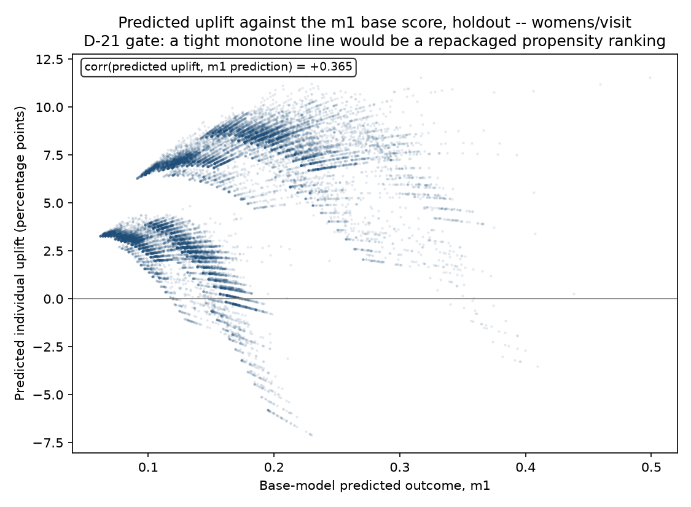

# Phase 4: Uplift modeling

Two T-learners per outcome — one for the mens email arm, one for the womens email arm — were fitted on a pre-committed half of the Hillstrom sample and scored on the other half. This write-up answers one question about them: which of their rankings carries real treatment-effect signal, and which is noise that a permutation of the treatment label would have produced anyway. It states the decision rule that separates the two **before** any number appears, then reports what that rule decided, including the cells it decided against. A non-technical, reader-facing overview arrives in Phase 7; this document is the technical evidence Phase 7 links to rather than re-derives.

Every number below is read from a committed artifact under `data/processed/`. Nothing here is recomputed by hand. The artifact each section quotes is named in that section, and the full list is at the bottom. Where a figure comes from somewhere other than a committed artifact — a constant in the codebase, or a measurement taken during this phase's research pass that the artifacts do not contain — that is stated at the point of use rather than left for a reader to assume.

**A note on the citation convention, so the difference between the three write-ups reads as deliberate.** `reports/validity.md` (Phase 2) traces every number to a committed artifact path. `reports/metric.md` (Phase 3) instead names the pytest node that reproduces each number, because Phase 3 built a metric and persisted nothing at all. Phase 4 persists four artifacts and thirteen figures, so this document reverts to Phase 2's convention.

## Acceptance criteria, stated before the analysis

A model cell — one (arm, outcome, learner) triple — is published as a real result only if **both** of the following hold:

**(a)** Its holdout Qini coefficient exceeds the 95th percentile of its own permutation null distribution.
**(b)** Its uplift ranking beats the response-model baseline on the same Qini axes, on the same holdout rows.

Both conditions, not either. Condition (b) is what makes this project's actual thesis — uplift, not propensity — the publishing bar rather than a side comparison. A ranking that clears its own null but cannot beat "who is most likely to buy" has not demonstrated the thing this project exists to demonstrate, however statistically real its signal is.

**Eligibility is restricted in advance.** Three learner configurations are fitted for every (arm, outcome) pair: a regularized linear learner, a random forest with `min_samples_leaf=200`, and a default-hyperparameter random forest. Only the **six linear cells** are eligible to clear the bar. Both forest configurations are diagnostic exhibits and can never be published as results, however their holdout Qini happens to land. This is designation in advance, not preference after the fact, and it does two things: it collapses multiplicity from eighteen candidate cells to six, and it keeps the pre-registration genuinely prior, which is the only property that gives it any value. Holm-correcting across all eighteen was considered and rejected — at this signal level it rejects everything by construction, which is an arithmetic consequence of having looked at too many cells rather than a finding.

**Two further gates can veto a cell regardless of its Qini.**

The **propensity gate**: the maximum absolute correlation between a cell's predicted uplift and *either* of its two base-model scores must stay at or below `0.9`. A cell above that threshold is reported as a repackaged propensity ranking and cannot be published however good its Qini looks, because a T-learner whose difference tracks one of its own base models is a "who is likely to buy" model wearing an uplift label. This is the only mechanism in the project that *enforces* the uplift-not-propensity claim rather than asserting it. Both base scores are checked, not one, because leaving either unguarded leaves the failure mode open.

The **calibration gate**, which is two gates. The **sign gate** is hard: a cell's mean predicted uplift must agree in sign with the committed Phase 2 average treatment effect for that same (arm, outcome) pair, and a disagreement fails the cell outright. It is the check that catches a swapped pair of base models, because that single mistake flips every predicted sign at once while raising nothing. The **magnitude band** is an *absolute*, per-cell tolerance: three times the seed-to-seed standard deviation of mean predicted uplift measured **in this repository**, across 20 re-drawn split seeds and 120 (cell, seed) observations, and carried as the constant `models.CALIBRATION_SD`. It is explicitly **not** an imported relative percentage. A single relative bar is structurally wrong here rather than merely less tidy: this phase's six committed effects span three orders of magnitude, from a +0.31 pp womens conversion effect to a +$0.77 mens spend effect, and one percentage cannot be right for both. The rejected imported band — a T-learner reported at 0.0769 to 0.0789 mean predicted visit uplift against a true effect of 0.0766, roughly a 0.4% to 3.0% relative window — is named beside the constant as an anchor that was deliberately not adopted, because applying a 5% relative bar to this repository's own numbers fails four of the six cells.

**The shared-control assumption, stated as an assumption.** The two email arms share the same control group: `data/processed/ate.parquet` reports `n_control` as **21,306** on all six of its rows, and an identical control base rate across both arms to within 1e-9. Both T-learners are therefore fitted against the same 21,306 customers, and their Qini coefficients are **correlated estimates that may not be numerically compared**. Radcliffe states this explicitly for this dataset; this project restates it rather than quietly ranking the two numbers. The consequence is stated once, above the table, so no later sentence has to walk it back: an argmax over the two arms' scores — email whichever arm the model predicts a larger effect for — is a **winner's-curse estimator** over two correlated noisy quantities, and it will be optimistic by construction. Phase 4 supplies the measured incomparability in section 7 and nothing more. Phase 5 builds and evaluates the targeting rule, using a bootstrap that resamples the shared control once per replicate.

**The split-noise caveat, also stated above the table.** Everything below comes from **one** pre-committed 50/50 arm-stratified split at seed 20260902, drawn once and materialized as a `split` column inside the checksum-gated build so no later phase can use a different one. That split is a real source of variation and this document does not pretend otherwise. During this phase's research pass, the same mens/visit linear cell measured a holdout Qini of **+0.001627** under a different legitimate split draw, against the **+0.003069** the committed split produces — roughly a twofold move on a quantity in the third decimal place. That research measurement is not reproducible from the committed artifacts, which carry one split by design, and it is quoted here as a caution rather than as a result. The honest framing is this: the decision rule was pre-registered and applied **once**, to **one** pre-committed split. That is what makes it a valid decision procedure. It does not make the underlying estimate precise, and the repeated-split distribution that would quantify the imprecision is explicitly deferred.

That rule is fixed here, above every result in this document, because a decision rule stated after the result it judges is not a decision rule. It is also stated where the code that applies it lives: `models.py`'s module docstring carries the eligibility restriction, the propensity gate at its threshold, the two calibration gates and the permutation null's mechanism, and the five-condition conjunction itself is written out in words directly above the expression that evaluates it in `pipeline.train()`. The criterion and the check cannot drift apart.

Two of the six eligible cells cleared both conditions. Both are on the womens arm. The details follow.

## 1. The six eligible cells

*Source: `data/processed/model_results.parquet` (18 rows, of which the 6 with `eligible == True` appear below), `data/processed/permutation_null.parquet` (1,600 rows).*

| Cell | Q train | Q holdout | train/holdout | baseline Q | (b) beats baseline | null p95 | p_emp | (a) exceeds p95 | calibration | propensity | **Published** |
|---|---|---|---|---|---|---|---|---|---|---|---|
| mens / visit | +0.003844 | +0.003069 | 1.25x | +0.003957 | No | +0.003449 | 0.0995 | No | pass | pass | **No** |
| mens / conversion | +0.000879 | -0.000134 | -6.56x | +0.000037 | No | +0.000576 | 0.6816 | No | pass | pass | **No** |
| mens / spend | +0.139327 | -0.000924 | -150.79x | +0.002696 | No | +0.095416 | 0.5174 | No | pass | pass | **No** |
| womens / visit | +0.008302 | **+0.009569** | 0.87x | +0.005227 | Yes | +0.005216 | 0.0100 | Yes | pass | pass | **Yes** |
| womens / conversion | +0.001049 | **+0.000876** | 1.20x | +0.000687 | Yes | +0.000658 | 0.0199 | Yes | pass | pass | **Yes** |
| womens / spend | +0.179422 | +0.066690 | 2.69x | -0.009032 | Yes | +0.083124 | 0.1045 | No | pass | pass | **No** |

Qini coefficients are in the outcome's own units, because the curve is normalized per treated head over the whole population — percentage points of visit or conversion rate, dollars of spend. `reports/metric.md` §1.1 states the normalization convention in full, and every number in this column was produced by the same `evaluation.qini_coefficient` call that Phase 3 built and tested before any model existed.

**Two cells clear both pre-registered conditions: womens/visit and womens/conversion.** Both are the primary linear learner. Neither is close to any veto gate.

**The cell this project's own planning documents are organised around — mens/visit — did not clear its own bar, and it failed both conditions.** Its holdout Qini of +0.003069 sits *below* its own permutation null's 95th percentile of +0.003449, with an empirical p-value 0.0995. And its ranking loses to the response-model baseline, which scores +0.003957 on the identical holdout rows: on the mens arm, at this split, "who is most likely to visit" is a *better* targeting order than "whose visit probability changes most because of the email". That is the negative result, it is the one a reader who knows this dataset will look for first, and it is stated here rather than steered around. The mens visit *average* effect is large and unambiguous — Phase 2 measures it at +7.66 pp with an interval nowhere near zero — but a large average effect and a learnable *heterogeneity* in that effect are different claims, and only the first is established.

The failure is recorded on the data as well as in this document. `data/processed/scored_holdout.parquet` carries a predicted uplift column for all six eligible cells, and the four that did not clear the bar carry an explicit `unproven_` prefix: `unproven_uplift_mens_visit`, `unproven_uplift_mens_conversion`, `unproven_uplift_mens_spend`, `unproven_uplift_womens_spend`. The two published cells carry the plain names `uplift_womens_visit` and `uplift_womens_conversion`. A downstream consumer — Phase 5, the Streamlit app, or a reviewer opening the Parquet — cannot select an unproven ranking without reading the word. The label lives on the data, not only in a report.

Because two cells cleared the bar, the fallback branch does not fire. Had none cleared it, the strongest holdout ranking would have been published anyway and labelled explicitly as not having cleared the pre-registered bar, with Phase 5 valuing it and reporting an interval that would probably span zero. That branch was written down in advance precisely so that a null result would not create pressure to loosen the rule, and nothing about the rule was adjusted after the results were seen.

`qini_train_holdout_womens_visit_linear.png` and `qini_train_holdout_womens_conversion_linear.png` draw each published cell's train and holdout curves on shared axes. The womens/visit ratio is **0.87x** — the holdout curve is *above* the training curve — and womens/conversion is **1.20x**. A train/holdout ratio near or below 1 is the shape a model that has not memorised its training half produces. Section 4 shows the other shape.

## 2. Conversion and spend as named negative results

*Source: `data/processed/model_results.parquet` (the four `eligible` rows for the conversion and spend outcomes), `data/processed/permutation_null.parquet` (200 draws per eligible cell).*

All three outcomes were fitted for both arms — six cells — and conversion and spend are reported here as results rather than omitted. Modelling only visit and never mentioning the other two is exactly the omission a knowledgeable reviewer notices, and the prior research predicted both would fail, which makes publishing them the honest move rather than a costly one.

**The negatives were tested exactly as hard as the positives, and that claim is checkable because it is literally true.** Every one of the six eligible cells ran the identical apparatus: the same T-learner shape, the same fixed hyperparameters, the same design matrix, the same response-model baseline, the same 200-shuffle refit permutation null, the same calibration gate and the same propensity gate. There is no tiering and no lighter treatment for the cells expected to fail. `model_results.parquet` carries the same 25 columns populated for all six rows, and `permutation_null.parquet` carries exactly 200 draws for each of them.

The four negative outcomes:

| Cell | Q holdout | Reading |
|---|---|---|
| mens / conversion | **-0.000134** | Negative holdout Qini. The training curve is positive (+0.000879); none of it survives out of sample, and the ratio is -6.56x. |
| mens / spend | **-0.000924** | Negative holdout Qini against a train Qini of +0.139327 — a ratio of -150.79x, and the most extreme overfit among the six linear cells. |
| womens / spend | +0.066690 | Positive, beats the baseline, and still fails: +0.066690 sits below its own null's 95th percentile of +0.083124, empirical p-value 0.1045. |
| mens / visit | +0.003069 | Positive, fails both conditions — section 1. |

**Spend deserves its own sentence, because it is weak for a reason that was known in advance.** Spend is fitted with a single Ridge regressor on raw dollars. The great majority of customers spend nothing, so the regressor is mostly fitting the zero mass, and both spend cells come out with a large training Qini and almost nothing out of sample. That is the finding, not a defect. The principled alternative for a zero-inflated outcome is a **two-part hurdle model** — a first stage for the probability of spending anything, and a second stage for expected spend conditional on spending. It was rejected here for two reasons stated in advance: it would break the one-shape T-learner that makes the identical-model-class requirement and the feature-space equality check structural rather than bespoke, and its first stage is the probability of a positive purchase, which on this data is *exactly the conversion cell already being fitted*. Most of the added sophistication would be a second copy of a model this phase already has.

`calibration_eligible_cells.png` shows all six eligible cells including these four, panelled by unit so the two dollar cells sit on their own axis rather than being drawn as if +$0.77 were +77 percentage points.

## 3. A divergence from the project's own pitfalls research

*Source: `data/processed/model_results.parquet` (the two conversion rows with `eligible == True`), `data/processed/permutation_null.parquet` (the `womens/conversion/linear` cell, 200 draws).*

Recorded here in the same voice `reports/metric.md` §4 uses for its own divergence, and for the same reason: a divergence stated plainly is evidence, while a divergence quietly resolved in one direction is a number nobody can check.

This project's pitfalls research states that conversion uplift is not learnable on this dataset — holdout Qini zero or negative for every configuration tried. Measured here:

| Cell | Q holdout | null p95 | p_emp | Clears (a)? |
|---|---|---|---|---|
| mens / conversion | **-0.000134** | +0.000576 | 0.6816 | No |
| womens / conversion | **+0.000876** | +0.000658 | 0.0199 | Yes |

**The research tested the mens arm only, and on the mens arm this repository reproduces its finding exactly** — a negative holdout Qini, an empirical p-value of two thirds, nothing there. On the **womens** arm the same apparatus produces a positive holdout Qini above its own null's 95th percentile, and the cell also beats its response-model baseline (+0.000876 against +0.000687), so it clears both pre-registered conditions.

This is a genuine divergence from the project's own prior research rather than a contradiction of it: the research made a claim about one arm and this repository confirms that claim on that arm while finding the opposite on the other. It is written up rather than suppressed because suppressing it would have meant either quietly dropping a cell that cleared a pre-registered bar, or quietly widening the claim the research actually made.

**The decision to fit all six cells is what made this visible at all.** Modelling only visit — the choice that would have looked reasonable and would have halved the phase — would have thrown away one of the two cells that cleared the bar. The effect is small in absolute terms (+0.000876 is under a tenth of a percentage point of conversion rate per treated customer), and it is one number from one split. It is reported at the strength the evidence supports and no further.

`permutation_null_womens_conversion_linear.png` and `uplift_vs_baseline_womens_conversion_linear.png` are this cell's two condition figures.

## 4. The forest exhibit: why holdout evaluation is not a formality

*Source: `data/processed/model_results.parquet` (the three `mens/visit` rows across all three learners), `data/processed/permutation_null.parquet` (the two mens/visit forest cells, 200 draws each).*

Three learner configurations were fitted on the mens/visit cell specifically so this document could demonstrate rather than cite the overfitting argument. All three are the same T-learner, the same design matrix, the same split, the same holdout; only the base learner differs.

| Learner | Q train | Q holdout | train/holdout ratio | prior research's cited ratio |
|---|---|---|---|---|
| `RandomForestClassifier()` — defaults | **+0.113882** | **+0.000469** | **242.70x** | 240x |
| `RandomForestClassifier(min_samples_leaf=200)` | +0.014322 | +0.000606 | 23.62x | 32x |
| `LogisticRegression` — the primary learner | +0.003844 | +0.003069 | 1.25x | 1.3x |

The default forest's training Qini is **thirty times** the linear learner's, and its holdout Qini is **one seventh** of it. A reader shown only the training column would conclude the forest is by far the best uplift model here. It is the worst of the three, and the gap between those two readings is the entire argument for evaluating an uplift model out of sample.

**The ratio landed on top of the cited figure, and that is not a stable property.** The default forest's 242.70x reproduces the prior research's cited 240x closely enough that this document can say *reproduced* rather than *cited*, and the linear learner's 1.25x matches its cited 1.3x. But **242.70x is one number from one split and must not be read as a law**. Under the alternative split draw described in the acceptance section, the same configuration produced the same spectacular training Qini against a *negative* holdout Qini — a ratio with the opposite sign. The exhibit works either way, arguably better with a negative holdout, but the specific multiple is an artifact of which rows landed in which half. The stable claim is the ordering — an unconstrained forest overfits the treatment label enormously, a leaf-constrained one much less, a penalized linear learner barely at all — and the specific multiples are not.

The three train-versus-holdout figures — `qini_train_holdout_mens_visit_linear.png` (1.25x), `qini_train_holdout_mens_visit_rf_leaf200.png` (23.62x) and `qini_train_holdout_mens_visit_rf_default.png` (242.70x) — read as a progression only together, which is why all three are committed even though none of these cells was published as a result.

**The flagship exhibit is the negative one.** `permutation_null_mens_visit_rf_default.png` draws the default forest's 200-draw permutation null with its observed holdout Qini marked on it. The observed value of **+0.000469** sits squarely *inside* the null mass, below the null's 95th percentile of +0.002611, with an empirical p-value 0.3930. The leaf-constrained forest is no better: +0.000606 against a p95 of +0.002345, empirical p-value 0.3383. Neither could have been published in any case — both are diagnostic exhibits by the eligibility restriction, decided in advance — but the permutation null says something stronger than "ineligible": a model with a training Qini of +0.113882 learned nothing about the treatment effect that shuffling the treatment label would not also have produced.

## 5. The two nulls, and why there are 200 draws

*Source: `data/processed/permutation_null.parquet` (1,600 rows: 8 cells x 200 draws, each row self-describing with its cell, draw index, null Qini, observed Qini, the 95th percentile and the empirical p-value).*

### 5.1 Two different nulls, two different hypotheses

This project has two things called a null, they are not the same mechanism, and a reader who meets both without a distinguishing sentence will conflate them.

**The permutation null used by condition (a)** permutes the **treatment label** within the training half — a rearrangement, so the treated and control counts are preserved exactly — and then **refits both base models** on the reshuffled group membership before scoring the untouched holdout with its true treatment labels and true outcomes. Every draw is produced by the same procedure that produced the observed value it is compared against. It centres near zero because the outcome stays attached to its own row, so a permuted "treated" group is a random mixture of genuinely treated and genuinely control customers, both base models then estimate approximately the same pooled response surface, and their difference is sampling noise.

**`evaluation.qini_random_band`**, Phase 3's null band, shuffles the **score** and **refits nothing**. Its signature takes no score argument at all, by design, so a model score cannot be passed into it by accident.

The refit null was chosen over the cheaper score shuffle because the score shuffle tests a strictly weaker hypothesis: it cannot detect a model that overfit the treatment label *during training*, which is precisely the failure section 4's forest exhibit exists to catch. That choice is substantive rather than stylistic, and it was measured: on the mens/visit cell at a reduced replicate count, the refit null's standard deviation is **1.32x** the score-shuffle null's on the same data, with the same centre. Refitting two base models on reshuffled membership is a materially larger source of variation than reordering one fitted model's scores. (That ratio is a property of one seed at a reduced replicate count, asserted in `tests/test_models.py` as "materially wider" rather than pinned as a value.)

Both quantities the null produces are reported in the table in section 1. Condition (a) turns on the **95th percentile of the 200 draws**, computed over the draws alone. The **empirical p-value** is a slightly different statistic — the fraction of draws at or above the observed value, with the observed value included in its own reference set — and the two can disagree by one draw at the boundary. Here they agree on all six eligible cells. The 95th percentile is what the pre-registered rule uses; the p-value is reported alongside it and did not decide anything.

**No p-value in this document is zero, and none can be.** The empirical p-value is computed as `(1 + count) / (1 + R)`, which is the standard construction for a valid Monte-Carlo p-value and has a floor of `1/201`, about 0.005. The smallest value anywhere in `permutation_null.parquet` is **0.009950** — the womens/visit cell, one draw at or above the observed value out of 200 — comfortably above that floor. The correct statement about a cell with no draw above its observed value would be that its p-value is *at most about 0.005*, never that it is zero.

### 5.2 Why 200 shuffles rather than the 50 the roadmap requires

The pre-registered rule turns on a 95th percentile, and a 95th percentile estimated from 50 draws is itself noisy enough to inject that noise straight into the publishing decision. That is an argument, not a measurement, so here is the measurement. The table below re-estimates each cell's threshold from the **first 50 draws** of the same committed stream and compares it against **all 200** draws of that same stream — the identical seed, the identical draws, only the count differs.

| Cell | p95 from first 50 draws | p95 from all 200 | shift |
|---|---|---|---|
| mens / visit | +0.003277 | +0.003449 | +5.3% |
| mens / conversion | +0.000518 | +0.000576 | +11.3% |
| mens / spend | +0.099480 | +0.095416 | -4.1% |
| **womens / visit** | **+0.004551** | **+0.005216** | **+14.6%** |
| womens / conversion | +0.000709 | +0.000658 | -7.2% |
| womens / spend | +0.085461 | +0.083124 | -2.7% |

**The largest movement — 14.6% — lands on womens/visit, the cell that cleared the bar.** A shift of that size in a publishing threshold, arising from replicate count alone and nothing else, is exactly the noise the 200-draw choice was made to suppress. This converts the replicate count from an assertion into a demonstrated decision, and it is the direct analogue of the coverage-band widening Phase 2 recorded after seeing seed-to-seed movement in its own simulation.

`permutation_null_womens_visit_linear.png` draws the null this table describes, with the observed +0.009569 out past the right edge of the null mass and clear of the 95th percentile — the visual contrast against the flagship forest figure in section 4 is the point.

## 6. Diagnostics, as passed or failed checks

### 6.1 Calibration

*Source: `data/processed/model_results.parquet` (`mean_predicted_uplift`, `committed_ate`, `calibration_abs_err`, `calibration_band`, `calibration_pass`), `data/processed/ate.parquet` (the six committed effects the comparison is against), `reports/figures/calibration_eligible_cells.png`.*

| Cell | mean predicted uplift | committed effect | absolute error | band | sign | pass |
|---|---|---|---|---|---|---|
| mens / visit | +0.079978 | +0.076590 | 0.003389 | 0.012279 | agrees | Yes |
| mens / conversion | +0.008462 | +0.006805 | 0.001657 | 0.002502 | agrees | Yes |
| mens / spend | +0.815288 | +0.769827 | 0.045461 | 0.470280 | agrees | Yes |
| womens / visit | +0.051727 | +0.045233 | 0.006493 | 0.009837 | agrees | Yes |
| womens / conversion | +0.002627 | +0.003111 | 0.000484 | 0.002595 | agrees | Yes |
| womens / spend | +0.420895 | +0.424412 | 0.003517 | 0.436089 | agrees | Yes |

**All six eligible cells pass both calibration gates.** Every mean predicted uplift agrees in sign with its committed effect, and every absolute error sits inside its own measured band. The comparison is against the **committed** Phase 2 effect read from `ate.parquet`, never against an effect recomputed inside this phase — comparing a model against a number the same phase produced would be a weaker check, and the committed value is the one Phase 2 canaried.

The bands are not vacuous. Against the maximum absolute error observed across the same 20 split draws the standard deviations were measured on, the six cells clear their bands by margins of 1.23x, 1.35x, 1.39x, 1.45x, 1.68x and 1.73x. Nor are they tight enough to fire on ordinary split noise. The two spend cells carry by far the widest bands in absolute dollars, which is the correct behaviour for the noisiest cells and exactly what a single relative percentage would have got wrong.

### 6.2 The propensity gate

*Source: `data/processed/model_results.parquet` (`corr_m0`, `corr_m1`, `max_abs_corr`, `propensity_gate_pass`, all 18 rows), `reports/figures/monotonicity_womens_visit_linear.png`, `reports/figures/monotonicity_womens_conversion_linear.png`.*

**The gate did not fire anywhere.** Across the six eligible cells the maximum absolute correlation between predicted uplift and either base score is **0.763524**, on **mens/spend against `m1`**, against a threshold of 0.9. Across all eighteen fitted cells including the forests the maximum is **0.880734**, on mens/conversion under the default forest — closer, still under. Per eligible cell: mens/visit 0.695108, mens/conversion 0.614281, mens/spend 0.763524, womens/visit 0.365111, womens/conversion 0.668035, womens/spend 0.759278.

**Neither published cell is anywhere near the threshold.** womens/visit is the *least* propensity-like cell in the entire table at 0.365111, and womens/conversion at 0.668035 has plenty of room. Whatever else is true of these two rankings, they are not repackaged "who is likely to buy" models.

The gate is nonetheless live rather than decorative. This phase's research pass re-drew the split across 20 seeds and found the mens/spend cell reaching **0.9234** against the same base model, which would have fired the gate. That is a research measurement and not a committed artifact number; it is quoted here as the reason the gate is not vacuous, and the shape of the finding — the spend cells sit closest to the threshold, the womens/visit cell furthest from it — is what the committed artifact reproduces.

`monotonicity_womens_visit_linear.png` and `monotonicity_womens_conversion_linear.png` are the two published cells' scatter plots of predicted uplift against the base score carrying their maximum correlation — the picture the propensity failure mode would show as a tight monotone line. **The two figures are drawn on different y-axis scales and a reader comparing them must not read the spacing as equivalent.** The visit figure is **linear**. The conversion figure is **symlog** — linear within ±1 percentage point and logarithmic beyond — and its axis label says so on the axis itself rather than in a caption, because these figures are committed separately so that one can be embedded on its own.

The asymmetry is deliberate and was measured rather than eyeballed. On the conversion cell, **97.90%** of the 21,347 points lie within ±1 pp while the minimum reaches **-22.93 pp**, so a linear axis renders the cloud as a blob with most of the canvas empty above one extreme row. On the visit cell only **5.97%** of points lie within ±1 pp and there is no tail at all — its range is -7.10 to +11.83 pp — so the same transform would push roughly 94% of an already-readable cloud into the logarithmic region and squash its dense band into a sliver. Two scales for one figure kind is a consistency wart; drawing one of them wrongly to match the other is the larger cost. Clipping the conversion axis was considered and rejected: it would hide real outlier customers to make the picture tidier, which is the trade this project exists not to make.

### 6.3 Tie diagnostics

*Source: `data/processed/model.json` (`tie_diagnostics`).*

Learner scores on this design are coarse enough that many customers receive identical predictions, and a Qini curve is an ordering, so ties are a real property of the input rather than a detail. Stated numerically rather than hand-waved:

| Arm | holdout scores | distinct values | tie groups | customers in a tie | largest tie group |
|---|---|---|---|---|---|
| mens | 21,307 | 18,922 | 288 | **12.5452%** | 0.1361% |
| womens | 21,347 | 18,909 | 291 | **12.7840%** | 0.1405% |

**The tie counts are identical across all three outcomes for a given arm**, and that is the informative part. Ties here are a property of **duplicate rows in the design matrix**, not of the learner: 21,307 mens holdout customers occupy only 18,922 distinct feature vectors, so roughly one customer in eight shares a feature vector with somebody else and is tied under *any* deterministic model of these seven covariates. Changing the outcome, or the learner, cannot break a tie between two customers whose features are identical.

This retroactively justifies Phase 3's seeded tie-break. That decision was made before any model existed, on the argument that a coarse learner score would produce ties and that resolving them by row order would make the Qini coefficient depend on how the frame happened to be sorted. At 12.5% of rows, this is not a corner case. The seeded shuffle inside `evaluation.qini_curve` is what makes the coefficient in section 1's table a property of the score rather than of the file.

One consequence is carried in the figures: every committed Qini curve is drawn from the **same** `(fraction, qini)` pair the table's coefficient was computed from, never from a second call, so a published image and a published number cannot disagree about a cell with ties.

## 7. The cross-arm block: a measured incomparability

*Source: `data/processed/model.json` (`cross_arm_metrics`, computed on the 10,653 control customers that appear in both arms' holdout).*

No rescaling of either arm's scores was attempted. Mean-matching each arm to its own committed effect was considered and rejected: an affine rescale does not fix rank-level incomparability, and it would make the calibration check in 6.1 trivially true by construction, destroying its value as a check. Instead the incomparability is recorded as a measurement, on the **10,653** control customers who sit in the holdout half and are therefore scored by *both* arms' models.

| Outcome | mens mean | mens SD | mens min | mens negative | womens mean | womens SD | womens min | womens negative | correlation | sign disagreement |
|---|---|---|---|---|---|---|---|---|---|---|
| visit | +0.079985 | 0.018029 | **+0.046469** | **0.0000%** | +0.051745 | 0.030749 | **-0.070802** | **4.4964%** | 0.422742 | 4.4964% |
| conversion | +0.008450 | 0.005427 | -0.226219 | 1.2203% | +0.002631 | 0.004266 | -0.229343 | 21.6183% | 0.456290 | 20.7359% |
| spend | +0.814413 | 0.644747 | -0.660077 | 4.6841% | +0.420370 | 0.691319 | -1.181298 | 29.7475% | 0.499303 | 26.8093% |

The two arms' scores correlate at roughly 0.42 to 0.50 on the same customers. That is the quantified version of the shared-control problem: the two rankings are neither independent nor interchangeable, and their Qini coefficients — computed against overlapping control rows — are not on a comparable footing. **No sentence in this document compares them numerically**, and the winner's-curse caution in the acceptance section is what a later phase has to reckon with when it does need to choose an arm per customer.

**This settles an open question this project had recorded as unknown, and the answer arrives on the opposite arm from the one the question named.** The question was whether a genuine negative-uplift segment — customers the email measurably *hurts* — survives holdout validation on the **mens** arm. On the visit outcome, at the committed split:

- **On the mens arm: no.** The minimum predicted visit uplift across all 10,653 shared customers is **+0.046469**, and the negative fraction is exactly **zero**. Not one of those customers is predicted to be harmed by the mens email. There is no negative segment on this arm to find.
- **On the womens arm: yes.** The minimum is **-0.070802** and **4.4964%** of the same customers are predicted below zero.

The phenomenon is real and it is on the other arm. The sign-disagreement fraction on visit is also 4.4964% — every customer the two models disagree about in sign is one the womens model puts below zero and the mens model does not, which is what a zero mens negative fraction forces arithmetically.

Two cautions on reading that. First, the womens/visit ranking cleared the pre-registered bar and the mens/visit ranking did not, so the negative segment appears on the arm whose ranking has the better evidence behind it — but "the ranking beat its null" is not the same claim as "these specific 4.5% of customers are harmed", and this document makes only the first. Second, the conversion and spend rows carry far larger negative fractions on the womens arm (21.6% and 29.7%), and both of those cells are noisier: womens/conversion clears the bar on an effect under a tenth of a percentage point, and womens/spend did not clear it at all. Phase 5 decides what to do with a quantified problem rather than an asserted one; Phase 4 supplies the quantification.

## 8. The committed figures, and why these thirteen

*Source: `reports/figures/` (13 Phase 4 PNGs, all drawn from the real holdout scores in `data/processed/scored_holdout.parquet`).*

The committed set is a **curated subset**, not one figure per cell, and the absent figures are a decision rather than an omission. Eighteen cells across five figure kinds would be roughly seventy images, most of them near-identical pictures of nothing. The curation rule, stated in full so a reader can check what is missing and why:

1. **Three train-versus-holdout Qini figures for the mens/visit progression** — the linear learner, the leaf-constrained forest and the default forest. These are cells that were *not* published as results, and they are committed anyway because they read as a progression only together: the overfitting argument in section 4 needs all three or none.
2. **Four per-cell figures for each of the two cells that cleared the bar** — train-versus-holdout Qini, the permutation null with the observed value marked, the uplift ranking against the response-model baseline, and the propensity monotonicity scatter. Both published cells get all four, so the second one is not presented as under-evidenced. Symmetry across the two is itself part of the honest presentation.
3. **One permutation-null figure for the default forest on mens/visit** — the flagship exhibit of section 4, and the only null figure for a cell that was never eligible.
4. **One calibration figure covering all six eligible cells at once**, panelled by unit, including the four that did not clear the bar.

Three plus eight plus one plus one is thirteen, across the five figure kinds:

| Kind | Files |
|---|---|
| Train vs holdout Qini | `qini_train_holdout_mens_visit_linear.png`, `qini_train_holdout_mens_visit_rf_leaf200.png`, `qini_train_holdout_mens_visit_rf_default.png`, `qini_train_holdout_womens_visit_linear.png`, `qini_train_holdout_womens_conversion_linear.png` |
| Permutation null with observed value | `permutation_null_mens_visit_rf_default.png`, `permutation_null_womens_visit_linear.png`, `permutation_null_womens_conversion_linear.png` |
| Uplift vs response-model baseline | `uplift_vs_baseline_womens_visit_linear.png`, `uplift_vs_baseline_womens_conversion_linear.png` |
| Calibration | `calibration_eligible_cells.png` |
| Propensity monotonicity | `monotonicity_womens_visit_linear.png`, `monotonicity_womens_conversion_linear.png` |

**Cells that were not published still appear**, deliberately: six of the thirteen figures are of cells that failed the bar or were never eligible. A figure set showing only the two successes would misrepresent what this phase did, which was mostly to rule things out.

These are also the **first uplift figures this project has committed**, reversing a Phase 3 decision recorded at the time. Phase 3 built the Qini machinery and refused to commit a figure of it, because a curve drawn on *synthetic* fixture data sitting in the same directory as the real Love plot and forest plot could be misread as a result, and it recorded that the first committed uplift figure would be this phase's. These thirteen are that set, and every one of them is drawn on real holdout scores.

`uplift_vs_baseline_womens_visit_linear.png` and `uplift_vs_baseline_womens_conversion_linear.png` need one note: both curves in those figures are measured on the **same holdout rows**, and the legend names them "Uplift ranking" and "Response-model baseline" rather than train and holdout. The relabelling is applied by the orchestrator that writes the figure, and it raises rather than publishing a wrong legend if the wording it expects has changed.

## 9. Method notes

**The design matrix and its encoding convention.** Every T-learner in this phase is fitted on one design matrix, built once from the seven pre-treatment covariates on all 64,000 rows and then sliced by arm and by split. The categorical columns are expanded with **all K levels** (`drop=None`), which is the **third** one-hot convention in this repository and is deliberate. `balance.py`'s module docstring, decision (b), documents the other two — all K for the balance table so no level is invisible on the Love plot, and K-1 plus a constant for the multinomial-logit design matrix. The collinearity argument that forces K-1 there does not transfer here: that model is an unpenalized maximum-likelihood fit whose rank-deficient design has no unique solution, whereas every learner in this phase is either L2-penalized or a tree ensemble. Trees positively require all K, because with a dropped level a single category becomes representable only as a conjunction of two splits. And all K yields exactly the same eleven expanded covariate names `balance.parquet` already carries, so this document's feature names and `reports/validity.md`'s balance table can be read side by side.

**The design matrix contains no post-treatment column.** The covariate list is read from a hard-coded allowlist, never derived by dropping outcome columns from a frame, because dropping is exactly how visit, conversion and spend leak into a feature set. `features.py` carries its own explicit guard naming the forbidden columns, and the guard is tested by monkeypatching a forbidden name onto the allowlist and asserting it fires.

**Hyperparameters are fixed literals with no tuning and no cross-validated grid**, identical across both arms. Identical capacity across arms is the requirement for stopping a T-learner degenerating into a propensity model: two base models with different capacity differ from each other for reasons that have nothing to do with treatment, and their difference then measures the learners rather than the effect. Both arms are built by calling one zero-argument factory twice, so "identical" is a property of the code rather than a claim made about it. Tuning was also rejected on its merits — improving a base learner's prediction quality does not reliably improve the ranking of the *difference* between two of them, which is a second-order quantity.

**The response-model baseline is the model this project argues against, built as favourably as possible.** It is the predicted outcome probability under treatment, from the **same learner class** as the uplift model, fitted on the treated arm only and ranked descending — the literal "who is most likely to buy" ranking. Using the same learner class isolates the uplift-versus-propensity contrast rather than confounding it with a difference in learners, and it is evaluated on identical Qini axes and the identical holdout rows. Its per-customer score is committed alongside the uplift scores, so a reader can recompute the comparison from the artifact.

**No model-quality figure from the classification family appears anywhere in this phase**, as a headline or otherwise. The metric family that judges a classifier by how often its predicted label is right, and its curve-area cousin whose name abbreviates to three letters ending in C, are the wrong yardstick for an uplift model: both score how well a model predicts *who responds*, and this project's entire argument is that who responds and whose behaviour *changes* are different orderings of the same customers. An uplift model is judged on the Qini arithmetic in `evaluation.py` and nowhere else. The exclusion is mechanical rather than a matter of discipline — the package modules are swept by test for the token spellings.

**The fitted estimators are not committed.** Model files are build-time only and gitignored. Every headline number in this document is reproducible from the committed artifacts with arithmetic alone, with no model file required, which is the property Phase 5 depends on.

## Conclusion

The pre-registered rule was applied once, to one pre-committed split, and **two of the six eligible cells cleared both of its conditions: womens/visit and womens/conversion.** Both beat their own permutation null's 95th percentile — empirical p-values 0.0100 and 0.0199 — and both beat the response-model baseline on the same Qini axes. Both pass the calibration gate and both sit far from the propensity threshold, womens/visit at 0.365111 being the least propensity-like cell in the whole table.

**Four eligible cells did not clear the bar, including the one this project's own research is organised around.** mens/visit failed both conditions: its holdout Qini of +0.003069 sits below its own null's 95th percentile, and the response-model baseline out-ranks it on the same rows. mens/conversion and mens/spend both produce *negative* holdout Qini. womens/spend beats its baseline and still falls short of its null. All four carry an `unproven_` prefix in the committed scored artifact so no downstream consumer can use one without reading the label.

**The forest exhibit is the phase's clearest single argument.** A default random forest reached a training Qini of +0.113882 on the mens/visit cell — thirty times the linear learner's — and a holdout Qini of +0.000469, sitting inside its own permutation null with an empirical p-value 0.3930. The train-to-holdout ratio of 242.70x is one number from one split and not a stable property; the ordering it illustrates is.

What this phase is entitled to claim is therefore narrow and specific: on the womens email arm, at one pre-committed split, a T-learner's ranking of predicted visit uplift and of predicted conversion uplift each carry signal that shuffling the treatment label does not reproduce, and each order customers better than a response model does. It is not entitled to claim that the mens arm has learnable heterogeneity, that spend uplift is estimable at targeting-cell sizes, that the two arms' coefficients can be ranked against each other, or that any of these estimates would survive a different split — the last of which is deferred rather than answered.

Two things carry forward. The scored holdout artifact gives Phase 5 a per-customer uplift for every eligible cell with the unproven ones labelled, and the cross-arm block in section 7 hands it a **quantified** incomparability rather than an asserted one, together with the winner's-curse caution that any per-customer arm choice has to answer.

## Inputs and artifacts

Every number in this document traces to one of these committed files:

- `data/processed/model_results.parquet` — the 18-row results table at grain (arm, outcome, learner), carrying train and holdout Qini, the response-baseline Qini, the null percentile and empirical p-value, both diagnostic gates and the publishing flag for every fitted cell
- `data/processed/permutation_null.parquet` — 1,600 self-describing rows over 8 cells x 200 refit shuffles, each carrying its own draw, the cell's observed Qini, its 95th percentile and its empirical p-value, so any quantile can be recomputed and any histogram redrawn without refitting
- `data/processed/scored_holdout.parquet` — 32,001 holdout customers with a predicted uplift per cell, both base-model scores and the response-baseline score behind each, with the `unproven_` prefix on the four cells that did not clear the bar
- `data/processed/model.json` — the scalar block: the split description, the four gate parameters, the six committed Phase 2 effects the calibration compares against, the cross-arm metrics on the shared control holdout, the per-arm tie diagnostics, and the headline counts
- `reports/figures/` — the thirteen curated Phase 4 figures listed in section 8

Inputs consumed by this phase, all checksum- and schema-gated by Phase 1 and analysed by Phase 2:

- `data/processed/analysis_table.parquet` — the validated 64,000-row table, carrying the materialized `split` column: 31,999 training rows and 32,001 holdout rows, arm-stratified at seed 20260902 and drawn exactly once
- `data/processed/mens_vs_control.parquet` and `data/processed/womens_vs_control.parquet` — the two arm frames, each built by positive membership against the shared 21,306-customer control group
- `data/processed/ate.parquet` — Phase 2's six committed average treatment effects, which the calibration gate in section 6.1 compares every cell's mean predicted uplift against

Related write-ups: `reports/validity.md` establishes that this experiment supports causal claims at all and reports the six average effects; `reports/metric.md` states the Qini normalization convention, the tie rule and both band definitions, and is the document to read before believing any Qini number quoted here.

Regenerate everything from a fresh clone with `python -m dont_email_everyone.pipeline all`.
