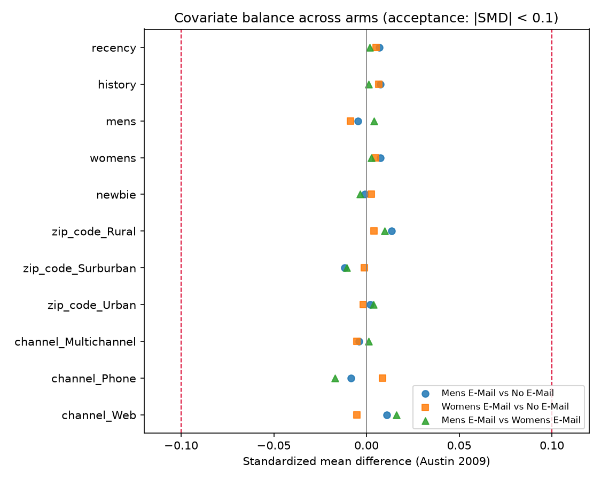
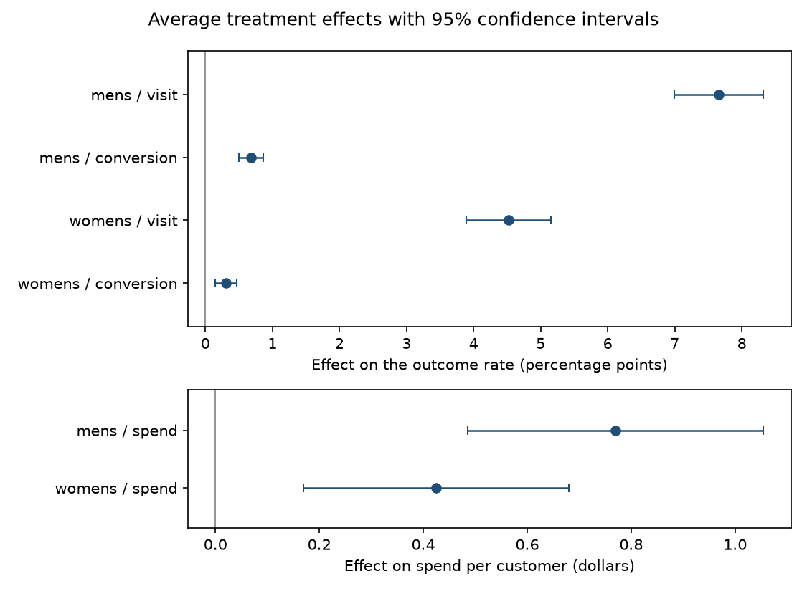

# Phase 2: Experiment validity

Does the Hillstrom 2008 experiment support causal claims at all, and what are the treatment effects it actually licenses? This write-up answers both, in that order. It covers randomization balance, the six average treatment effects, their robustness, and the cell size below which the confidence intervals stop being trustworthy. A non-technical, reader-facing overview arrives in Phase 7; this document is the technical evidence Phase 7 will link to rather than re-derive.

Every number below is read from a committed artifact under `data/processed/`. Nothing here is recomputed by hand. The artifact each section quotes is named in that section, and the full list is at the bottom.

## Acceptance criteria, stated before the analysis

Randomization is accepted if both of the following hold:

**(a)** Every |SMD| is below 0.1 across all three pairwise comparisons.
**(b)** The omnibus multinomial-logit likelihood-ratio test does not reject at alpha = 0.05.

Per-covariate p-values are reported for completeness but are **not** part of the criterion. With 21 tests, roughly one p-value below 0.05 is expected under perfect randomization, so a single significant covariate would not have overturned the conclusion. As it happens none occurred — the smallest of the 21 p-values is 0.194.

That rule is fixed here, above every result in this document, because a decision rule stated after the result it judges is not a decision rule. It is also stated in `balance.py`'s module docstring, where the code that applies it lives, so the criterion and the check cannot drift apart. The 0.1 threshold is Austin's (2009) convention — a standardized difference of 10% corresponds to a phi coefficient of 0.05 — and lives in the codebase as the single named constant `balance.SMD_THRESHOLD`, read by the estimator, the tests, and the Love plot alike.

Both conditions are met. The details follow.

## 1. Balance evidence

*Source: `data/processed/balance.parquet` (33 rows), `reports/figures/love_plot.png`.*

The balance table is 11 expanded covariates across 3 pairwise comparisons. All three pairs are present — Mens vs Control, Womens vs Control, **and Mens vs Womens**. The third pair matters: a check that compared only each treatment arm against control would cover two of the three assignments and would miss an imbalance between the two email arms entirely, which is exactly the comparison Phase 4's multi-arm targeting rule depends on.

| Statistic | Value |
|---|---|
| Rows (covariates x comparisons) | 33 |
| Maximum \|SMD\| | **0.016900** — `channel_Phone`, Mens vs Womens |
| Rows at or above the 0.1 threshold | **0** |
| Largest vs-control \|SMD\| | **0.013659** — `zip_code_Rural`, Mens vs Control |

The maximum observed imbalance is roughly one sixth of the acceptance threshold. Condition (a) is met with a wide margin.

The x axis is pinned at (-0.12, 0.12) rather than auto-scaled. That is deliberate and it is load-bearing for the figure's honesty: at a maximum |SMD| of 0.0169, an auto-scaled axis puts both ±0.1 threshold lines off the canvas and the plot degenerates into a vertical smear that conveys no sense of scale. With the limits fixed, the dashed threshold lines sit near the plot edges and every point is visibly clustered near zero — the reader can see how much room the result has, not merely that the points are somewhere.

The `zip_code_Surburban` tick label is drawn verbatim. That misspelling is in the source data, is asserted literally by the Phase 1 schema, and is preserved so that the figure and the committed artifact agree; a presentation-only relabelling would make them disagree.

**The balance table contains only pre-treatment covariates.** This is structural, not a matter of care: the covariate list is read from `config.PRE_TREATMENT_FEATURES`, a hard-coded allowlist, and is never derived by dropping outcome columns from the frame. Dropping is exactly how `visit`, `conversion` and `spend` leak into a covariate set. A second explicit guard raises a `ValueError` naming the offending column if a post-treatment name ever reaches the expansion step, and a test monkeypatches `spend` onto the allowlist to prove that guard fires rather than merely existing.

## 2. Per-covariate tests and the omnibus test

*Source: `data/processed/balance.parquet` (`test` / `statistic` / `p_value` columns), `data/processed/ate.json` (`omnibus_balance_lr_test`).*

Reporting the 21 per-covariate tests is the completeness the pre-registered rule promised. There are 21 rather than 33 because the tests are defined on the 7 raw features, not on the 11 one-hot levels — a chi-square test on `channel` is one test, not three, and expanding first would both inflate the multiple-comparisons arithmetic and test the same categorical three times. Numeric covariates take a Welch t-test; the two string covariates take a chi-square test on the two-arm crosstab.

| Statistic | Value |
|---|---|
| Tests | 21 (7 raw covariates x 3 comparisons) |
| Below p = 0.05 | **0** |
| Minimum p-value | **0.19377** — `channel`, Mens vs Womens (chi-square 3.28219) |

The smallest p-value in the entire family is 0.194, roughly four times the conventional threshold.

**The omnibus test is the actual decision instrument**, and it is a single test:

| Multinomial-logit likelihood-ratio test | Value |
|---|---|
| LR chi-squared | 11.130 |
| Degrees of freedom | 18 |
| p-value | **0.888753** |

Condition (b) is met, and not narrowly — p = 0.89 is close to the middle of the null distribution.

Why an omnibus test and not 21 individual ones. The question "did randomization hold?" is a single question about the joint assignment mechanism, so it deserves a single test with a single error rate. Twenty-one separate tests answer twenty-one different questions and, at alpha = 0.05, produce about one false positive by construction — under the null, the probability of seeing at least one significant result among 21 independent tests is about 66%. A framework that would have been embarrassed by that one result is a framework that punishes correct randomization roughly two times in three. The multinomial logit asks the right question directly: can the arm label be predicted from the covariates at all? Here it cannot, and 18 degrees of freedom is the price of asking about all of them at once.

Read the other direction, the omnibus test is also the failure signal that would matter. A genuinely broken randomization would show up as many covariates leaning the same way — precisely the joint structure an omnibus test detects and a scan of individual p-values misses.

## 3. Average treatment effects

*Source: `data/processed/ate.parquet` (6 rows), `data/processed/ate.json` (`effects`), `reports/figures/ate_forest.png`.*

Six pre-registered tests: 2 arms x 3 outcomes. All effects are absolute differences from the shared control group, estimated by OLS with HC3-robust standard errors. The two binary outcomes are fitted as linear probability models deliberately, so all three outcomes take the same inferential path and the `treatment` coefficient is directly the reported effect with no transformation step in between.

| Arm | Outcome | Control base | Effect | Published | 95% CI | Raw p | Holm p |
|---|---|---|---|---|---|---|---|
| mens | visit | 10.617% | **+7.6590 pp** | +7.66 pp | [6.9953, 8.3226] pp | 2.774e-113 | 1.664e-112 |
| mens | conversion | 0.5726% | **+0.6805 pp** | +0.68 pp | [0.5000, 0.8610] pp | 1.473e-13 | 5.893e-13 |
| mens | spend | $0.65279 | **+$0.769827** | +$0.77 | [$0.48514, $1.05451] | 1.158e-07 | 3.474e-07 |
| womens | visit | 10.617% | **+4.5233 pp** | +4.52 pp | [3.8894, 5.1573] pp | 1.941e-44 | 9.704e-44 |
| womens | conversion | 0.5726% | **+0.3111 pp** | +0.31 pp | [0.1499, 0.4724] pp | 1.559e-04 | 3.117e-04 |
| womens | spend | $0.65279 | **+$0.424412** | +$0.42 | [$0.16896, $0.67987] | 1.129e-03 | 1.129e-03 |

All six survive Holm-Bonferroni at alpha = 0.05.

**Reproducing Radcliffe's published figures is the check that catches a pooled-control grouping bug.** This is the single most consequential correctness property in the project. The `mens_vs_control` frame is built by *positive membership* — keep rows whose segment is Mens E-Mail or No E-Mail — never by excluding the mens label and keeping the remainder. The exclusion-based construction produces a 42,693-row pool that contains all 21,387 Womens-emailed customers, who were themselves treated. Every effect above would then be computed against a contaminated counterfactual and would be roughly 25-30% wrong, with nothing raising an error and no figure looking odd.

The structural evidence that the frames are not pooled sits in the table itself: the **control base rate is identical across arms** — visit 10.617%, conversion 0.5726%, spend $0.65279 on both the mens and the womens rows, to within 1e-9 — and `n_control` is 21,306 in all six rows while `n_treated` is 21,307 (mens) and 21,387 (womens). Both arm frames genuinely see the same 21,306 control customers. A pooled frame could not produce that.

The forest plot is drawn in **two panels with separate x axes**: the four proportion effects in percentage points, the two spend effects in dollars. The panels are not comparable and should not be read as one scale. The split is driven by the table's own `unit` column rather than by a hard-coded outcome list, so the +$0.77 spend effect can never be rendered as "+76.98pp" by a shared formatter. A zero reference line is drawn in each panel; no interval crosses it.

**A note on the Holm correction.** The six outcomes are strictly nested — spend above zero implies conversion, which implies visit — so they are heavily positively correlated rather than independent. Holm-Bonferroni assumes nothing about dependence and is therefore *conservative* here rather than exact: the true family-wise error rate is below the nominal 5%. Since all six tests reject by wide margins (the largest adjusted p-value is 1.129e-03), the conservatism costs nothing in this case. The correction is applied across exactly these six pre-registered tests and the code raises on any other row count, so an exploratory seventh test cannot be added later without loudly rescaling every adjusted p-value.

## 4. Methodology note on standard errors

A reviewer who knows the White family of heteroskedasticity-consistent estimators will check this, so it is stated precisely.

**HC2 reduces exactly to the Welch standard error in the two-group case, and HC3 is the small-sample-conservative member of the same White family, agreeing with Welch to five decimal places at these sample sizes.** On mens spend the two are algebraically identical to 13 significant figures (Welch 0.14524656024868676, HC2 0.14524656024869173); HC3 comes in at 0.14524996883999752, very slightly larger by design. HC3 is adjacent to Welch, not equal to it.

One further detail explains a difference a reader might otherwise take for a discrepancy: setting `cov_type` makes statsmodels set `use_t = False`, so these intervals use the normal critical value 1.96 rather than a t critical value. That is why the HC3 interval and a Welch t-interval on the same data differ in the sixth decimal (0.485142 vs 0.485140) instead of being bit-identical. It is a difference of critical-value convention, not of method, and it is invisible at any reporting precision this document uses.

## 5. Robustness

### 5.1 Covariate adjustment

*Source: `data/processed/ate.parquet` (`effect_adj` / `ci_low_adj` / `ci_high_adj`).*

The headline effects are unadjusted differences in means. Beside each, the same model refit controlling for every pre-treatment covariate:

| Arm | Outcome | Unadjusted | Adjusted | Relative move |
|---|---|---|---|---|
| mens | visit | 0.076590 | 0.076059 | -0.69% |
| mens | conversion | 0.006805 | 0.006773 | -0.47% |
| mens | spend | 0.769827 | 0.766873 | -0.38% |
| womens | visit | 0.045233 | 0.045409 | +0.39% |
| womens | conversion | 0.003111 | 0.003112 | +0.03% |
| womens | spend | 0.424412 | 0.424639 | +0.05% |

**Adjustment moves every point estimate by under 1%** — the largest move is 0.69%. That is the strongest single sentence available for the randomization argument, and it is stronger than any balance table, because it is a statement about the estimates that actually matter rather than about the covariates. If assignment were confounded, controlling for the confounders would move the estimates; here there is nothing for the controls to absorb. The adjusted column is reported as robustness and never replaces the headline: Radcliffe's published figures are themselves unadjusted, and reproducing them is what catches the grouping bug described above.

### 5.2 Bootstrap cross-check

*Source: `data/processed/ate.json` (`bootstrap_spend_mens`).*

Spend is severely zero-inflated — only 267 of 21,307 treated customers and 122 of 21,306 control customers spent anything at all — which is the standard reason to distrust an analytic interval. So it was checked directly, with a seeded percentile bootstrap on the mens spend effect:

| | Interval |
|---|---|
| Bootstrap (percentile, R = 4,000, seed **20260902**) | [$0.484514, $1.055786] |
| Analytic HC3 | [$0.485142, $1.054512] |

The two agree to roughly one cent at both endpoints. The honest reading is therefore **not** that the analytic interval is wrong because spend is zero-inflated — at n = 42,613 the central limit theorem has done its work and the Welch/HC3 interval is fine here. What is true is that this reassurance is a statement about *this sample size*, and it degrades as cells shrink. Section 6 quantifies exactly where.

The seed, replicate count and method are recorded in the artifact alongside the interval, so the number is reproducible rather than merely reported.

### 5.3 Winsorization

*Source: `data/processed/ate.json` (`winsorization_robustness`, four labelled rows).*

Two clearly labelled variants, neither of which is the headline:

| Arm | Variant | Threshold | Rows trimmed | Effect | 95% CI |
|---|---|---|---|---|---|
| mens | `topcode_499` | $499.00 | **0** | $0.769827 | [$0.48514, $1.05451] |
| mens | `pct_99_9` | $233.30 | 43 | $0.649256 | [$0.42885, $0.86966] |
| womens | `topcode_499` | $499.00 | **0** | $0.424412 | [$0.16896, $0.67987] |
| womens | `pct_99_9` | $209.91 | 43 | $0.361996 | [$0.16681, $0.55718] |

**`topcode_499` is a genuine no-op, and that is itself the finding.** The source data is already censored at $499, so clipping there trims nothing — `n_trimmed` counts rows strictly above the threshold, and zero is the correct answer, not a bug. This is the variant that addresses the censoring artifact, and it measures that artifact as having no effect on the estimate at all.

**`pct_99_9` is a deliberate stress test, not a result.** It trims 43 of only 267 non-zero treated purchases — 16% of every purchase that happened — and moves the mens spend effect from $0.769827 to $0.649256, a fall of 15.7%. Given how aggressive that clip is, a ~16% arithmetic move is what should be expected; it is not evidence of instability. Sign, statistical significance and conclusion all survive: the interval [$0.42885, $0.86966] excludes zero comfortably.

Quoting the `pct_99_9` row alone would tell a reader the headline is fragile when the actual censoring artifact is a no-op. Both variants are emitted together in the artifact for exactly that reason, and neither may be quoted without the other.

## 6. Coverage vs. cell size

*Source: `data/processed/coverage.parquet` (5 rows), `data/processed/ate.json` (`coverage_summary`).*

Section 5.2 established that the Welch interval is trustworthy at full arm size. This section establishes where it stops being trustworthy, because a Phase 5 targeting decile is a much smaller cell than a full arm. The simulation treats the real mens-arm spend vectors as finite populations and resamples cells from them, so the true effect — $0.769827 — is known exactly by construction rather than estimated, and "did this replicate's interval cover the truth?" has an unambiguous answer on every draw. R = 4,000 replicates per cell, seeded.

| Cell size | Coverage | Median CI width | Replicates with a zero-variance arm |
|---|---|---|---|
| 42,613 (full arm) | **95.25%** | $0.5693 | 0.00% |
| 4,000 | 94.68% | $1.8379 | 0.00% |
| 2,000 | 93.60% | $2.5308 | 0.33% |
| 1,000 | 91.75% | $3.4011 | 6.43% |
| 400 | **85.23%** | $4.4290 | **38.05%** |

At full arm size the interval does what it claims: 95.25% against a nominal 95%. Degradation is monotone as cells shrink and becomes material well before the smallest cell — by cell size 1,000 a nominal 95% interval is really a 92% interval, and at 400 it is an 85% interval. A "95% confidence interval" that covers 85% of the time is not a rounding issue; it is a different claim.

**The most persuasive number in this table is not the coverage column.** It is that at cell size 400 — the scale of a targeting decile — **38.05% of samples contain an arm in which nobody spent anything at all.** More than one sample in three has no purchases whatsoever in one of its two arms. With only 267 treated and 122 control spenders per 21,306-row arm, a 400-customer cell expects roughly five treated purchases and two control ones, so this is arithmetic rather than misfortune. In those replicates the standard error is exactly zero and the interval is undefined; a further 2.33% are degenerate for related reasons. The practical consequence for Phase 5 is direct: a per-decile spend interval at that cell size is not a weak estimate, it is frequently not an estimate at all.

**Why the degradation belongs to the data and not to the code.** The same interval machinery was run against a Gaussian oracle — two normals with a known mean gap, no skewness, no zero-inflation — at the same cell sizes, and it returns 95.02% / 95.25% / 94.95% at cells 400 / 1,000 / 4,000, at nominal across the board where the empirical DGP has already fallen to 85%. Without that companion test there would be two indistinguishable explanations for the table above — spend is severely skewed at small cell sizes, or the confidence-interval construction is simply wrong — and the table would be an unsupported claim rather than evidence. **The Gaussian oracle is what establishes that the interval machinery itself is correct**; the empirical table is then a statement about spend.

**An honest caveat on the comparison to the research note.** This simulation reproduces the reference note's *median interval widths* within 3% at every cell size, which is the tight cross-check. Its *coverage percentages* land 1-2 percentage points lower than that document's. At R = 4,000 the Monte-Carlo standard error of a coverage estimate near 0.95 is 0.0034, so a 1.8pp gap is about five standard errors — real, not noise. The gap is a difference in **data-generating process**, not an error in either place: the reference note states no DGP, no seed, and no replicate count, and a coverage simulation is highly sensitive to all three, plus to whether the population is the empirical spend vector or a fitted parametric model and to whether "cell size" means the total or the per-arm count. The same sensitivity applies to the degenerate-cell rate, where the note's figure is 37.4% against the 38.05% this repo's seeded sweep produces — the same finding to within Monte-Carlo noise, not a reproduction of an identical number. This document therefore claims agreement on widths and on the qualitative degradation, and does not claim to have reproduced the note's coverage percentages exactly.

One reproducibility note for anyone re-running this: the sweep consumes a single seeded random stream across the whole five-cell grid, so a one-off single-cell call returns a slightly different median width for that same cell. Every number above is quoted from the full five-cell sweep as committed.

## Conclusion

Both pre-registered acceptance conditions are met. Every |SMD| is below 0.1 across all three pairwise comparisons, with a maximum of 0.016900 against a threshold of 0.1, and the omnibus likelihood-ratio test does not reject (p = 0.888753). Covariate adjustment moves every treatment effect by under 1%, which is the behaviour a valid randomization predicts and a confounded one does not. **The experiment supports causal interpretation, and the six average treatment effects reproduce Radcliffe's published figures.**

Two bounds carry forward. The intervals reported here are trustworthy at full arm size and degrade materially below roughly cell size 1,000, so any per-segment spend interval Phase 5 reports needs either a much larger cell or a different interval construction. And the ATE answers "did emailing help on average", not "who changed behaviour because they were emailed" — that is the uplift question, and it is Phase 3 and Phase 4's subject.

## Inputs and artifacts

Every number in this document traces to one of these committed files:

- `data/processed/balance.parquet` — the 33-row Austin (2009) SMD table across all three pairwise comparisons, with each row's raw feature in `source_covariate` and that feature's per-covariate test (`test`, `statistic`, `p_value`) joined on
- `data/processed/ate.parquet` — the six pre-registered treatment effects with HC3-robust intervals, the covariate-adjusted estimate beside each, and the Holm-adjusted p-values
- `data/processed/coverage.parquet` — the five-row Welch-interval coverage sweep across the locked cell grid
- `data/processed/ate.json` — the scalar block: the six effects with intervals, the seeded bootstrap cross-check, the omnibus balance test, both labelled winsorization variants, and the balance and coverage summaries
- `reports/figures/love_plot.png` — the covariate Love plot with the ±0.1 acceptance band on the canvas
- `reports/figures/ate_forest.png` — the six effects with intervals, panelled by unit

Inputs, all checksum- and schema-gated by Phase 1:

- `data/processed/analysis_table.parquet` — the validated 64,000 x 12 table
- `data/processed/mens_vs_control.parquet` — the mens-email-vs-control analysis frame (42,613 x 13)
- `data/processed/womens_vs_control.parquet` — the womens-email-vs-control analysis frame (42,693 x 13)

Regenerate everything from a fresh clone with `python -m dont_email_everyone.pipeline all`.
